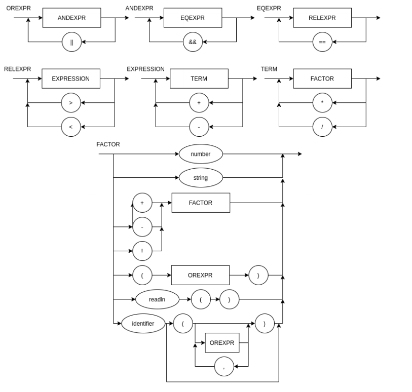

# LinguagemProgramacao
Atividade prática supervisionada da matéria Lógica da Computação
INSPER 2021/1

## e-linguaggio

A e-linguaggio é uma linguagem de programação baseada no idioma italiano. Ela tem como intuito facilitar o aprendizado de uma linguagem de programação para aqueles que falam italiano, porém, não compreendem inglês muito bem.
A motivação dessa linguagem surgiu ao tentar explicar um código para um conhecido italiano, como o mesmo não entendia inglês, foi necessário explicar utilizando somente termos italianos. A e-linguaggio surge como um diferencial para ele e tantos outros que podem usá-la.

Sua principal característica está em receber entradas escritas em italiano, por exemplo, ao querer escrever algo na tela, o usuário deve utilizar o termo "stampare", análogo ao "print line".

Esta linguagem foi desenvolvida em phyton e tem como base o compilador que foi criado nessa mesma disciplina, suas informações quanto ao funcionamento podem ser compreendidas na EBNF e no diagrama sintático. 


## EBNF

FUNCDEFBLOKC = {  λ | TYPE, IDENTIFIER, "(", { TYPE, IDENTIFIER, "," }, ")", COMMAND } ;
BLOCK = "{", COMMAND, "}" ;   
COMMAND = ( (ASSIGNMENT | PRINT | DECLARATION, RETURN, ( IDENTIFIER, "(" {OREXPR}, ",", ")" ), ";" )  | ( λ, ";" | BLOCK | WHILE | IF ) ;  
ASSIGNMENT = IDENTIFIER, "=", EXPRESSION ;   
RETURN = "ritorno" , OREXPR;
DECLARATION = ( "int" |  "bool" | "string" ),  IDENTIFIER ";" ;                                       
PRINT = "stampare", "(", (EXPRESSION | NUMBER ), ")" ;                                
WHILE = "while", "(", EXPRESSION, ")", COMMAND, BLOCK ;  
IF = "se", "(", EXPRESSION, ")", (COMMAND | COMMAND, "altro", COMMAND) ;  
OREXPR = ANDEXPR, { "||" } ;  
ANDEXPR = EQEXPR, { "&&" } ;  
EQEXPR = RELEXPR, { "==" } ;  
RELEXPR = EXPRESSION, { (">" | "<"), EXPRESSION } ;  
EXPRESSION = TERM, { ("+" | "-"), TERM } ;  
TERM = FACTOR, { ("*" | "/"), FACTOR } ;  
FACTOR = (("+" | "-" | "!"), FACTOR) | NUMBER | IDENTIFIER IDENTIFIER, "(" {OREXPR}, ",", ")" ), ";"| "(", EXPRESSION, ")" | "leggere",  "(", ")" | STRING | BOOL ;  
READLN = "leggere", "(", ")" ;  
IDENTIFIER = LETTER, { LETTER | DIGIT | "_" } ;    
NUMBER = DIGIT, { DIGIT } ;  
STRING = """, "LETTER", { LETTER | DIGIT | "_" }, """;   
BOOL = "vero" | "falso" ;   
LETTER = ( a | ... | z | A | ... | Z ) ;    
DIGIT = ( 1 | 2 | 3 | 4 | 5 | 6 | 7 | 8 | 9 | 0 ) ;    


## Para utilizar bastar rodar:

```
$ python3 main.py test1.c 
```
Sendo 'test.c', um arquivo .c que contém a expressão que deseja compilar.

###### Ex:
```
$ python3 main.py test1.c
```

###### Ex arquivo test1.c:
```
{
    int soma()
    {
        stampare(999);
    }

    int main()
    {
        soma();
        bool x;
        x = falso;
        string y;
        y = "aaa";
        se (x)
        {
            soma();
        }
        altro{
            stampare(y);
        }
    }
}
```
## Base de testes
Dentro da pasta 'testes' existem arquivos com exemplos de testes que podem ser utilizados nessa linguagem. 


## Diagrama Sintático
O diagrama sintático dessa linguagem está abaixo:
[]() 
[]()  
